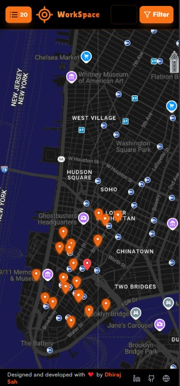

# 🧭 CasualCubicles

**Discover your perfect spot to work, study, or meet up — anywhere in your city.**  
CasualCubicles helps work-from-home professionals, students, freelancers, and casual groups find welcoming cafés, libraries, and coworking spaces with **real-time info** on opening hours, reviews, and more.

 

---

## 🌟 Features

- 🔍 **Nearby Map & List**  
  Instantly see and browse cafes, libraries, and coworking spaces near you.

- 🟢 **Smart Status**  
  Know which places are Open, Closed, or have hours unavailable (live from Google).

- 🗂 **Detailed Cards**  
  See ratings, user reviews, and operating hours at a glance.

- 📱💻 **Mobile & Desktop Friendly**  
  Fully responsive UI for phones, tablets, or laptops.

- 🎯 **Easy Filtering**  
  Search and filter locations to find your ideal spot.

- 🧭 **Navigation Ready**  
  Quick links to Google Maps for turn-by-turn directions.

---

### 💻 Desktop View


### 📱 Mobile View


---

## 🧑‍💻 Target Audience

- Remote workers & freelancers  
- Students seeking study spots  
- Casual and professional meet-ups  
- Anyone looking for a cozy workspace outside home or office

---

## 🚀 Getting Started

### 📦 Prerequisites

- [Node.js](https://nodejs.org/) (v18.x or newer recommended)
- npm or yarn
- A [Google Places API key](https://developers.google.com/maps/documentation/places/web-service/overview) (for live data)

### 🔧 Installation

1. **Clone the repository**
   ```bash
   git clone https://github.com/DhirajSah736/CasualCubicles.git
   cd CasualCubicles

2. **Install dependencies**
   ```bash
    npm install
        or
    yarn install

3. **Configure API Key**
   ```bash
   VITE_GOOGLE_PLACES_API_KEY=your_actual_key_here

4. **Run the project locally**
   ```bash
    npm run dev
        or
    yarn dev
    
---

## 👨‍💻 Author

**Dhiraj Sah**

- 📧 **Email:** [eyemdheeraj436@gmail.com](mailto:eyemdheeraj436@gmail.com)  
- 💼 **LinkedIn:** [linkedin.com/Dhiraj Sah](https://www.linkedin.com/in/dhiraj-sah-tech/)  
- 🧑‍💻 **GitHub:** [github.com/DhirajSah736](https://github.com/DhirajSah736)  
- 🌐 **Portfolio:** [Dhiraj Sah](https://www.dhirajsah99.com.np)


---

### 📄 LICENSE

MIT License

Copyright (c) 2025 Dhiraj Kumar Sah

Permission is hereby granted, free of charge, to any person obtaining a copy of this software and associated documentation files (the “Software”), to deal in the Software without restriction, including without limitation the rights to use, copy, modify, merge, publish, distribute, sublicense, and/or sell copies of the Software, and to permit persons to whom the Software is furnished to do so, subject to the following conditions:

The above copyright notice and this permission notice shall be included in all copies or substantial portions of the Software.

The Software is provided “as is”, without warranty of any kind, express or implied, including but not limited to the warranties of merchantability, fitness for a particular purpose, and noninfringement. In no event shall the authors or copyright holders be liable for any claim, damages, or other liability, whether in an action of contract, tort, or otherwise, arising from, out of, or in connection with the Software or the use or other dealings in the Software.
